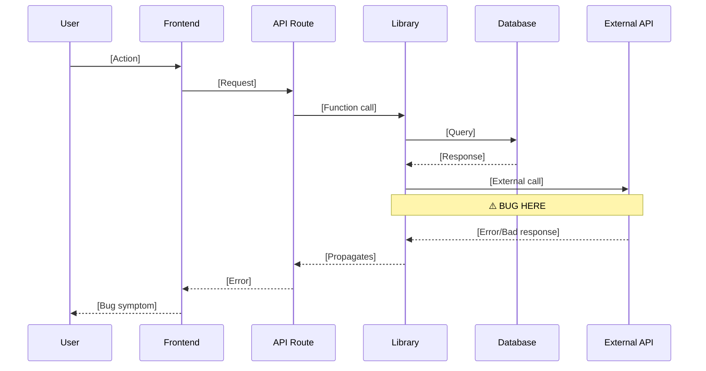
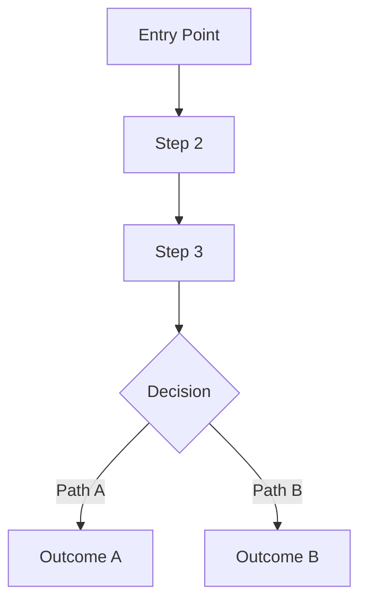

# Bug Investigation Output Templates

> Standardized formats for investigation reports and findings

---

## Bug Report Template

```markdown
# Bug Report: [Short Title]

**ID:** BUG-[YYYY-MM-DD]-[XXX]
**Reported:** [Date]
**Reporter:** [Name/Source]
**Severity:** [CRITICAL / HIGH / MEDIUM / LOW]

---

## Symptom

### What's happening?
[Clear description of the bug]

### Expected behavior
[What should happen instead]

### Error message
```
[Exact error text or stack trace if available]
```

### Reproduction steps
1. [Step 1]
2. [Step 2]
3. [Step 3]

### Frequency
- [ ] Always reproducible
- [ ] Intermittent (pattern: ___)
- [ ] One-time occurrence

### Environment
- **URL/Page:** [where it happens]
- **User role:** [if relevant]
- **Browser:** [if UI bug]
- **Time:** [when it happened]

### Recent changes
[Any known deployments, data changes, or configuration changes]

---

## Attachments

- [ ] Screenshot
- [ ] Console logs
- [ ] Network tab export
- [ ] Database query results
```

---

## Investigation Report Template

```markdown
# Investigation Report: [Bug Title]

**Bug ID:** BUG-[YYYY-MM-DD]-[XXX]
**Investigated:** [Date]
**Investigator:** [Name]
**Time spent:** [X hours]
**Status:** [Root cause identified / Needs more info / Cannot reproduce]

---

## Executive Summary

[2-3 sentences: What the bug is, what causes it, and the fix]

---

## Symptom Analysis

**Reported behavior:** [What user sees]
**Actual behavior:** [What code does]
**Gap:** [The difference that constitutes the bug]

---

## Entry Point

**Type:** [UI / API / Background Job / Data]
**File:** `[path/to/file.ts]`
**Function:** `[functionName()]` (line [X])

---

## Data Flow Trace



### Step-by-step trace

| Step | File | Function | Line | What happens |
|------|------|----------|------|--------------|
| 1 | [file] | [func] | [line] | [description] |
| 2 | [file] | [func] | [line] | [description] |
| 3 | [file] | [func] | [line] | ⚠️ **BUG:** [description] |

---

## Root Cause

**Location:** `[file:line]`

**Problem:** [Clear description of the code defect]

**Why it causes the symptom:**
1. [Chain of events]
2. [Leading to]
3. [The visible bug]

**Why it wasn't caught:**
- [Reason 1: e.g., no test coverage for this path]
- [Reason 2: e.g., only happens under specific conditions]

**Confidence:** [HIGH / MEDIUM / LOW]

**Evidence:**
```typescript
// [file:lines]
[The problematic code]
```

---

## Hypotheses Considered

### ✓ Confirmed: [Hypothesis that was correct]
- Evidence: [What confirmed it]

### ✗ Ruled out: [Hypothesis that was wrong]
- Evidence: [What ruled it out]

### ? Inconclusive: [Hypothesis that couldn't be confirmed]
- Why: [What's missing to confirm/rule out]

---

## Recommended Fix

### Primary Fix

**File:** `[path/to/file.ts]`
**Lines:** [X-Y]

**Before:**
```typescript
[Current problematic code]
```

**After:**
```typescript
[Fixed code]
```

**Explanation:** [Why this fix works]

### Additional Fixes

| File | Lines | Change | Reason |
|------|-------|--------|--------|
| [file] | [lines] | [change] | [reason] |

---

## Testing

### Verify the fix

```typescript
// Test case to add
describe('[feature]', () => {
  it('[test description]', async () => {
    // Arrange
    [setup]
    
    // Act
    [action]
    
    // Assert
    [verification]
  });
});
```

### Manual verification steps

1. [ ] [Step 1]
2. [ ] [Step 2]
3. [ ] [Step 3]

### Regression check

- [ ] Existing tests still pass
- [ ] Related functionality still works
- [ ] No new errors in logs

---

## Related Issues

**Same pattern found in:**

| File | Line | Risk | Fix included? |
|------|------|------|---------------|
| [file] | [line] | [HIGH/MED/LOW] | [Yes/No] |

**Related bugs:**
- [Link to related bug if any]

---

## Prevention

### How to prevent similar bugs

1. **Code review checkpoint:** [What to check for]
2. **Test coverage:** [What tests to add]
3. **Documentation:** [What to document]

### Suggested process improvement

[Any workflow or tooling changes that would catch this earlier]

---

## Timeline

| Time | Action |
|------|--------|
| [time] | Bug reported |
| [time] | Investigation started |
| [time] | Root cause identified |
| [time] | Fix implemented |
| [time] | Fix verified |
| [time] | Deployed |
```

---

## Quick Trace Template

```markdown
# Data Flow Trace: [Feature/Endpoint]

**Traced:** [Date]
**Entry point:** `[path/to/entry.ts]`

---

## Flow Diagram



---

## Detailed Trace

### 1. [Step Name]
**File:** `[path]`
**Function:** `[name]` (line [X])
**Input:** `[type/shape]`
**Output:** `[type/shape]`
**Calls:** [next function]

### 2. [Step Name]
[Same format...]

---

## Database Operations

| Step | Table | Operation | Conditions |
|------|-------|-----------|------------|
| [#] | [table] | SELECT/INSERT/UPDATE | [where clause] |

---

## External API Calls

| Step | Service | Endpoint | Purpose |
|------|---------|----------|---------|
| [#] | [service] | [endpoint] | [why] |

---

## Error Paths

| Step | Error Condition | Handling | Result |
|------|-----------------|----------|--------|
| [#] | [condition] | [how handled] | [user sees] |
```

---

## Pattern Search Template

```markdown
# Pattern Search: [Pattern Name]

**Searched:** [Date]
**Pattern:** [Description of what was searched for]

---

## Search Method

```bash
# Command/regex used
[grep command or search description]
```

---

## Results

### High Risk (Fix immediately)

| File | Line | Code Snippet | Why High Risk |
|------|------|--------------|---------------|
| [file] | [line] | `[snippet]` | [reason] |

### Medium Risk (Fix soon)

| File | Line | Code Snippet | Why Medium Risk |
|------|------|--------------|-----------------|
| [file] | [line] | `[snippet]` | [reason] |

### Low Risk (Track for later)

| File | Line | Code Snippet | Why Low Risk |
|------|------|--------------|--------------|
| [file] | [line] | `[snippet]` | [reason] |

---

## Summary

- **Total occurrences:** [X]
- **High risk:** [Y]
- **Medium risk:** [Z]
- **Low risk:** [W]

**Recommended action:** [What to do about these]
```

---

## Quick Reference Card

```markdown
# Bug Investigation Quick Reference

## Phase Checklist

- [ ] 1. Capture symptom clearly
- [ ] 2. Identify entry point
- [ ] 3. Trace data flow
- [ ] 4. Form hypotheses
- [ ] 5. Inspect suspect code
- [ ] 6. Determine root cause
- [ ] 7. Recommend fix
- [ ] 8. Check related issues

## Key Questions

**Symptom:**
- What exactly happens?
- What should happen?
- How often?
- Any patterns?

**Entry point:**
- UI, API, background job, or data?
- Which file starts the flow?

**Investigation:**
- What does the data flow look like?
- Where do things diverge from expected?
- What's the earliest point of failure?

**Root cause:**
- Why does this code fail?
- Why wasn't it caught before?
- Is it a symptom of a deeper issue?

**Fix:**
- What's the minimal fix?
- Are there related issues?
- How do we prevent recurrence?

## Common Patterns

| Symptom | Usually Check |
|---------|---------------|
| Works sometimes | Race conditions, caching, rate limits |
| Broke after deploy | Env vars, migrations, dependencies |
| Works locally only | Env differences, data volume, auth |
| Can't reproduce | User data state, permissions, timing |
| Duplicate actions | Webhook + polling, retry without idempotency |
| Missing data | RLS policies, FK constraints, null handling |
| Wrong data | Type coercion, timezone issues, stale cache |
```
