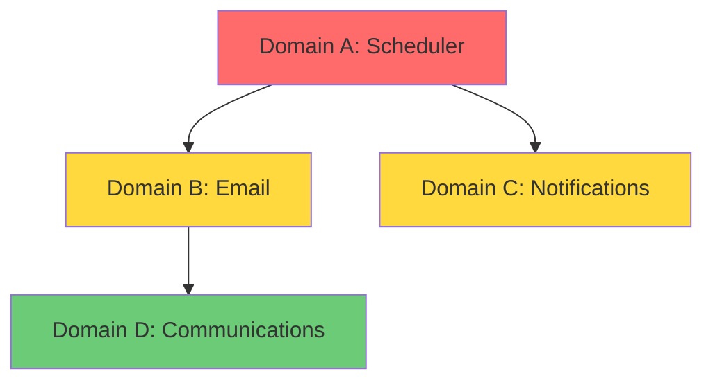
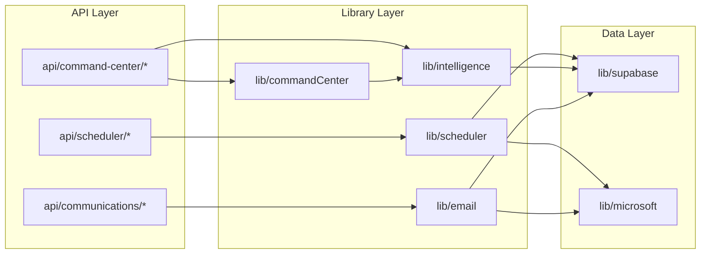

# Consolidation Audit Output Templates

> These templates define the exact structure for consolidation planning documents.

---

## DOMAIN-ANALYSIS.md Template

```markdown
# Domain Analysis Report

**Generated:** [TIMESTAMP]
**Based on Documentation:** [DATE OF LAST DOC AUDIT]
**Domains Identified:** X

---

## Executive Summary

| Domain | Primary Location | Duplicate Locations | Severity | Effort |
|--------|------------------|---------------------|----------|--------|
| Scheduler | src/lib/scheduler/ | 4 locations | 🔴 HIGH | 3 hours |
| Entity Matching | src/lib/intelligence/ | 3 locations | 🟡 MEDIUM | 2 hours |
| Email Sending | src/lib/email/ | 2 locations | 🟢 LOW | 1 hour |

**Total Duplicates Found:** X files with duplicate logic
**Estimated Cleanup Effort:** Y hours

---

## Domain: Scheduler

### Overview
**Primary Location:** src/lib/scheduler/ (30 files)
**Purpose:** Handles all meeting scheduling, availability checking, and calendar integration
**Database Tables:** scheduler_requests, scheduler_responses, scheduler_settings

### Duplicate Locations Found

| Location | Type | Overlap | Evidence |
|----------|------|---------|----------|
| src/lib/ai/meetingScheduler.ts | Full duplicate | 80% | Same DB queries, same API calls |
| api/meetings/direct-book/route.ts | Partial duplicate | 40% | Inline scheduling logic |
| components/scheduler/SchedulerModal.tsx | Logic duplicate | 30% | Client-side availability |
| src/lib/commandCenter/scheduleAction.ts | Partial duplicate | 25% | Creates scheduler requests |

### Impact of Current State
- Bug fixes must be applied in 4+ places
- Inconsistent behavior between scheduling entry points
- Testing burden multiplied

### Recommended Consolidation
Consolidate to src/lib/scheduler/ with single entry points for:
- `createSchedulingRequest()`
- `processSchedulerResponse()`
- `checkAvailability()`
- `sendSchedulerEmail()`

---

## Domain: Entity Matching

[Same format...]

---

## Domain: Email Sending

[Same format...]

---

## Priority Order

Based on severity and impact:

1. **Scheduler** (HIGH) - Most duplicates, most bug reports
2. **Entity Matching** (MEDIUM) - Known competing systems
3. **Email Sending** (LOW) - Mostly consolidated already

---

## Verification

- [ ] All major domains identified
- [ ] All duplicate locations found via grep/import tracing
- [ ] Evidence provided for each duplicate claim
- [ ] User confirmed analysis before proceeding to plans
```

---

## [DOMAIN]-PLAN.md Template

```markdown
# [Domain] Consolidation Plan

**Generated:** [TIMESTAMP]
**Domain:** [DOMAIN NAME]
**Canonical Location:** [PATH]
**Duplicates to Remove:** X
**Estimated Effort:** Y hours
**Risk Level:** [LOW/MEDIUM/HIGH]

---

## Current State

### Canonical Module
**Location:** src/lib/[domain]/
**Files:** X files
**Exports:** Y functions

| Export | File | Lines | Purpose | Test Coverage |
|--------|------|-------|---------|---------------|
| functionA | fileA.ts | 20-80 | Does X | ✓ Yes |
| functionB | fileB.ts | 15-60 | Does Y | ✗ No |

### Duplicate #1: [path]
**File:** [full path]
**Lines:** [start-end]
**Similarity:** X% overlap with canonical

**What it duplicates:**
| Duplicate Function | Canonical Equivalent | Difference |
|--------------------|---------------------|------------|
| createThing() | canonical/create.ts:createThing() | Older API format |
| processThing() | canonical/process.ts:processThing() | Missing error handling |

**Why it exists:**
[Brief explanation of how this duplicate came to be - different feature, older version, etc.]

**Evidence of duplication:**
```typescript
// Duplicate (src/lib/ai/thing.ts:45-50)
const result = await supabase
  .from('things')
  .insert({ name, type, status: 'pending' });

// Canonical (src/lib/thing/create.ts:30-38)
const result = await supabase
  .from('things')
  .insert({ name, type, status: 'pending', created_by: userId });
```

**Consumers of this duplicate:**
| Consumer | Import Line | Usage Lines |
|----------|-------------|-------------|
| src/app/api/X/route.ts | 5 | 25, 40, 55 |
| src/components/Y.tsx | 8 | 30-45 |

---

### Duplicate #2: [path]

[Same format...]

---

## Canonical Module Gaps

Functions found in duplicates but missing from canonical:

| Function | Found In | Should Add to Canonical? | Reason |
|----------|----------|-------------------------|--------|
| quickCreate() | duplicate1.ts:80 | ✓ Yes | Useful shortcut |
| legacyFormat() | duplicate2.ts:120 | ✗ No | Deprecated format |

---

## Migration Steps

### Pre-Migration
- [ ] Create branch: `consolidate/[domain]`
- [ ] Verify all tests pass on main
- [ ] Review this plan with team

### Step 1: Update Canonical Exports
**File:** src/lib/[domain]/index.ts
**Action:** Add missing exports identified above
**Changes:**
```typescript
// Add to index.ts
export { quickCreate } from './quickCreate';
```
**Risk:** NONE (additive)
**Verify:** Import works from test file

---

### Step 2: Migrate [Consumer 1]
**File:** src/app/api/X/route.ts
**Current Import (line 5):**
```typescript
import { createThing } from '@/lib/ai/thing';
```
**New Import:**
```typescript
import { createThing } from '@/lib/[domain]';
```
**Lines to Update:** 25, 40, 55
**Function Signature Change:** None (compatible)
**Risk:** LOW
**Verify:** 
- [ ] API route responds correctly
- [ ] Test: `curl -X POST /api/X -d '{...}'`

---

### Step 3: Migrate [Consumer 2]
[Same format...]

---

### Step N: Delete Duplicate
**Pre-conditions:**
- [ ] Step 2 complete and tested
- [ ] Step 3 complete and tested
- [ ] `grep -r "ai/thing" src/` returns nothing

**Action:** Delete src/lib/ai/thing.ts
**Verify:** Build succeeds, tests pass

---

## Post-Migration

### Verification Checklist
- [ ] All tests pass
- [ ] No imports of deleted files: `grep -r "[deleted-file]" src/`
- [ ] Canonical module is only implementation
- [ ] Update MODULES.md documentation

### Cleanup
- [ ] Remove empty directories
- [ ] Update any documentation referencing old paths
- [ ] Close related tech debt issues

---

## Rollback Plan

**If issues found after Step N:**
1. `git checkout main -- [affected-files]`
2. Redeploy previous version
3. Investigate failure before retrying

**Full rollback:**
1. `git revert [consolidation-commits]`
2. Keep notes on what failed for next attempt
```

---

## MIGRATION-ORDER.md Template

```markdown
# Consolidation Migration Order

**Generated:** [TIMESTAMP]
**Total Domains:** X
**Total Effort:** Y hours
**Recommended Timeline:** Z weeks

---

## Guiding Principles

1. **Independent domains first** - Domains with no cross-dependencies
2. **High-value first** - Domains causing the most bugs/confusion
3. **Low-risk first** - Build confidence with easier wins
4. **Test between domains** - Full regression between each domain

---

## Recommended Order

### Week 1: [Domain A]

**Why first:**
- Isolated (no dependencies on other domains being consolidated)
- High bug rate (5 bugs last month traced to duplicates)
- Clear canonical version exists

**Effort:** 3 hours
**Risk:** Medium
**Dependencies:** None

**Success Criteria:**
- [ ] All [Domain A] code in src/lib/[domainA]/
- [ ] No duplicate implementations remain
- [ ] All tests pass
- [ ] No new bugs in 48 hours

---

### Week 2: [Domain B]

**Why second:**
- Depends on [Domain A] being consolidated
- Medium complexity
- Good test coverage

**Effort:** 2 hours
**Risk:** Low
**Dependencies:** [Domain A] complete

**Success Criteria:**
- [ ] All [Domain B] code in src/lib/[domainB]/
- [ ] No duplicate implementations remain
- [ ] All tests pass

---

### Week 3: [Domain C]

[Same format...]

---

## Dependency Graph



**Legend:**
- 🔴 Red: Consolidate first (no dependencies)
- 🟡 Yellow: Consolidate after dependencies
- 🟢 Green: Consolidate last (depends on multiple)

---

## Risk Mitigation

### High-Risk Steps Identified

| Domain | Step | Risk | Mitigation |
|--------|------|------|------------|
| Scheduler | Step 5: Refactor direct-book | Logic replacement | Extra testing, staged rollout |
| Entity Matching | Step 3: Remove AI matcher | Core functionality | Keep backup, monitor closely |

### Rollback Triggers

Automatically rollback if:
- Test suite failures > 5%
- Error rate increase > 2x baseline
- Any P0 bug in consolidated code

---

## Progress Tracking

| Domain | Status | Started | Completed | Issues |
|--------|--------|---------|-----------|--------|
| Scheduler | ⏳ Not Started | - | - | - |
| Entity Matching | ⏳ Not Started | - | - | - |
| Email | ⏳ Not Started | - | - | - |

---

## Estimated Total Impact

**Before Consolidation:**
- X duplicate implementations
- Y files with redundant logic
- Z bug reports due to inconsistency

**After Consolidation:**
- Single source of truth per domain
- ~30% reduction in lib/ code
- Single place to fix bugs
```

---

## DEPENDENCY-MAP.md Template

```markdown
# Codebase Dependency Map

**Generated:** [TIMESTAMP]
**Modules Analyzed:** X
**Dependencies Traced:** Y

---

## How to Read This Map

- **→** means "imports from"
- **Circular dependencies** are flagged with ⚠️
- **Orphaned modules** (nothing imports them) are flagged with 🔴

---

## Core Dependencies



---

## Module Details

### src/lib/scheduler/

**Imports from:**
| Module | Functions Used |
|--------|----------------|
| @/lib/supabase | createClient |
| @/lib/microsoft | getCalendarEvents, sendEmail |
| @/lib/intelligence | matchEntities |

**Imported by:**
| Module | Functions Used |
|--------|----------------|
| api/scheduler/* | createSchedulingRequest, processResponse |
| api/command-center/[id]/schedule | createSchedulingRequest |
| components/scheduler/* | checkAvailability |
| lib/commandCenter/scheduleAction | createSchedulingRequest |

**Circular Dependencies:** None ✓

---

### src/lib/ai/meetingScheduler.ts 🔴 DUPLICATE

**Imports from:**
| Module | Functions Used |
|--------|----------------|
| @/lib/supabase | createClient |
| @/lib/microsoft | getCalendarEvents |

**Imported by:**
| Module | Functions Used |
|--------|----------------|
| api/ai/schedule | createMeetingRequest |
| lib/commandCenter/scheduleAction | createMeetingRequest |
| components/ai/AIScheduler | createMeetingRequest |

**Note:** This duplicates src/lib/scheduler/. See SCHEDULER-PLAN.md for migration.

---

### src/lib/intelligence/orphanedHelper.ts 🔴 ORPHANED

**Imports from:**
| Module | Functions Used |
|--------|----------------|
| @/lib/supabase | createClient |

**Imported by:**
NONE - This file is not imported anywhere.

**Recommendation:** Verify not used via dynamic import, then delete.

---

## Circular Dependencies Found

### ⚠️ Circular: lib/commandCenter ↔ lib/intelligence

```
lib/commandCenter/actions.ts 
  → imports lib/intelligence/entityMatcher.ts
  
lib/intelligence/contextPipeline.ts
  → imports lib/commandCenter/createItem.ts
```

**Impact:** May cause initialization issues, makes testing harder
**Resolution:** Extract shared logic to lib/shared/ or break cycle

---

## Orphaned Files

Files with no imports (candidates for deletion):

| File | Last Modified | Likely Status |
|------|---------------|---------------|
| src/lib/intelligence/orphanedHelper.ts | 3 months ago | Dead code |
| src/lib/email/oldSender.ts | 6 months ago | Replaced |
| src/lib/ai/experimentalMatcher.ts | 2 months ago | Abandoned experiment |

**Verification required before deletion** - may be dynamically imported or used in scripts.
```

---

## Verification Checklist Template

```markdown
# Consolidation Verification Checklist

## Pre-Consolidation
- [ ] Documentation audit is current (within 1 week)
- [ ] All domains identified and confirmed
- [ ] Canonical versions selected for each domain
- [ ] Migration plans reviewed and approved
- [ ] Branch created for consolidation work
- [ ] Current tests all passing

## During Consolidation

### [Domain] Consolidation
- [ ] Step 1 complete: [description]
  - [ ] Code change made
  - [ ] Local tests pass
  - [ ] Committed with descriptive message
- [ ] Step 2 complete: [description]
  - [ ] Code change made
  - [ ] Local tests pass
  - [ ] Committed with descriptive message
[...continue for all steps...]
- [ ] Duplicate files deleted
- [ ] Grep verification: no imports of deleted files
- [ ] Full test suite passes

## Post-Consolidation
- [ ] All domains consolidated
- [ ] No duplicate implementations remain
- [ ] MODULES.md updated
- [ ] DEPENDENCY-MAP.md updated
- [ ] PR reviewed and merged
- [ ] Deployed to staging
- [ ] Smoke tests pass on staging
- [ ] Deployed to production
- [ ] Monitor for 48 hours
- [ ] Close related issues/tickets
```
