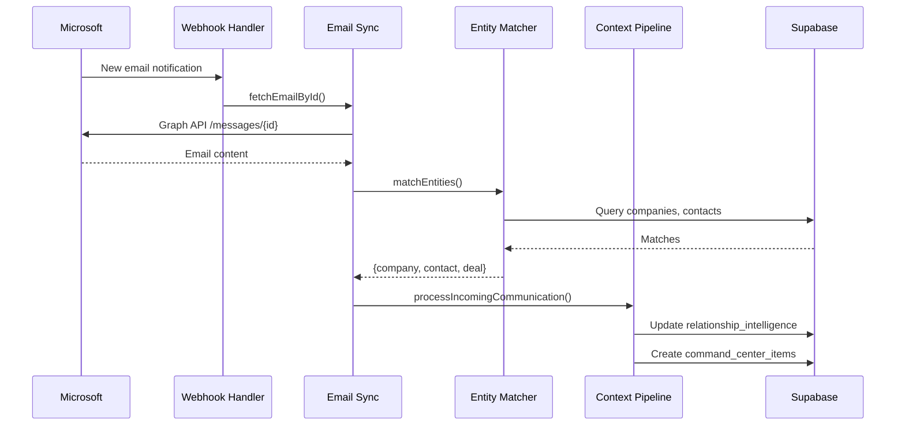

# X-FORCE Documentation Audit Skill

> **Version:** 1.0.0  
> **Purpose:** Generate comprehensive, accurate, evidence-based documentation  
> **Mode:** READ-ONLY — This skill NEVER modifies source code

---

## CRITICAL CONSTRAINTS

### 🚫 ABSOLUTE PROHIBITIONS

1. **NEVER modify any file outside `/docs/generated/`**
2. **NEVER "fix" code you discover during documentation**
3. **NEVER assume what code does — read it and cite it**
4. **NEVER summarize without line number citations**
5. **NEVER skip files because they "seem similar"**
6. **NEVER make up function names, parameters, or behaviors**

### ✅ REQUIRED BEHAVIORS

1. **ALWAYS cite file:line for every claim**
2. **ALWAYS read the actual file before documenting it**
3. **ALWAYS complete each section before moving to the next**
4. **ALWAYS ask for confirmation at checkpoints**
5. **ALWAYS flag uncertainties with `[UNCERTAIN]` tags**
6. **ALWAYS include "Last Verified" timestamps**

---

## EXECUTION PHASES

This audit runs in 7 phases. **STOP after each phase and confirm with the user before proceeding.**

### Phase 1: Structure Discovery
**Goal:** Create a complete manifest of what exists

```
Output: /docs/generated/MANIFEST.md
```

**Steps:**
1. List every directory under `src/`
2. List every file in each directory
3. List every directory under `supabase/migrations/`
4. List every file in `scripts/`
5. List every route in `src/app/api/`
6. Count totals: X directories, Y files, Z API routes, W migrations

**Checkpoint:** Show user the manifest. Ask: "Does this match your understanding of the project structure? Any directories missing?"

---

### Phase 2: Database Schema
**Goal:** Document every table, column, relationship, and index

```
Output: /docs/generated/DATABASE.md
```

**Steps:**
1. Read each migration file in chronological order
2. For each `CREATE TABLE`:
   - Document table name
   - Document every column with type and constraints
   - Document foreign keys
   - Note which migration created it
3. For each `ALTER TABLE`:
   - Document what changed
   - Note which migration changed it
4. For each index, document what it's for
5. Build a relationship diagram (mermaid ERD)

**Format for each table:**
```markdown
### `table_name`
**Created:** `migrations/YYYYMMDD_name.sql` (line X)
**Modified:** `migrations/YYYYMMDD_name.sql` (line Y)

| Column | Type | Constraints | Notes |
|--------|------|-------------|-------|
| id | UUID | PK, DEFAULT gen_random_uuid() | |
| name | VARCHAR(255) | NOT NULL | |
| company_id | UUID | FK → companies.id, ON DELETE CASCADE | |

**Indexes:**
- `idx_table_company` on `company_id` (line Z)

**RLS Policies:**
- `policy_name`: SELECT WHERE user_id = auth.uid() (line W)
```

**Checkpoint:** Show user table list. Ask: "Are there any tables you expected to see that aren't here?"

---

### Phase 3: API Routes
**Goal:** Document every API endpoint with request/response shapes

```
Output: /docs/generated/API.md
```

**Steps:**
1. For each directory in `src/app/api/`:
2. For each `route.ts` file:
   - Identify HTTP methods (GET, POST, PUT, DELETE)
   - Extract request body type/validation
   - Extract response shape
   - Note authentication requirements
   - Note which lib modules it imports
   - Document error responses

**Format for each endpoint:**
```markdown
### `POST /api/intelligence/collect/[companyId]`
**File:** `src/app/api/intelligence/collect/[companyId]/route.ts`
**Auth Required:** Yes (Supabase session)

**Request:**
```typescript
// Lines 15-20
{
  sources?: string[];  // Which sources to collect
  force?: boolean;     // Re-collect even if fresh
}
```

**Response (200):**
```typescript
// Lines 45-48
{
  jobId: string;
  status: 'started';
}
```

**Response (401):** Unauthorized
**Response (500):** `{ error: string }`

**Dependencies:**
- `src/lib/intelligence/collector.ts` (line 5)
- `src/lib/supabase/server.ts` (line 3)
```

**Checkpoint:** Show user the route list. Ask: "Any routes you expected that aren't documented?"

---

### Phase 4: Library Modules
**Goal:** Document every module in `src/lib/` with exports, dependencies, and database usage

```
Output: /docs/generated/MODULES.md
```

**Steps:**
For each directory in `src/lib/`:
1. Read the index.ts (if exists) to find public exports
2. For each .ts file:
   - List all exported functions/classes/types
   - For each export:
     - Document parameters and return type
     - Document what it does (in 1-2 sentences)
     - List internal imports (other src/lib modules)
     - List external imports (npm packages)
     - List Supabase tables it queries/modifies
     - List external APIs it calls (fetch, axios, etc.)

**Format:**
```markdown
## `src/lib/intelligence/`

### Overview
Purpose: AI-powered analysis of communications and entity matching
Status: 🟢 ACTIVE (8 files) | 🟡 TRANSITIONAL (4 files) | 🔴 DEPRECATED (5 files)

### `contextFirstPipeline.ts`
**Status:** 🟢 ACTIVE
**Lines:** 1-450
**Last Modified:** [check git or file timestamp]

**Exports:**
| Export | Type | Line | Description |
|--------|------|------|-------------|
| `processIncomingCommunication` | async function | 45 | Main entry point for all inbound communications |
| `ProcessingResult` | type | 12 | Return type for processing functions |

**Function: `processIncomingCommunication`**
```typescript
// Lines 45-48
async function processIncomingCommunication(
  communication: IncomingCommunication,
  options?: ProcessingOptions
): Promise<ProcessingResult>
```

**Internal Dependencies:**
- `./entityMatcher.ts` → `matchEntities` (line 8)
- `./salesPlaybook.ts` → `PLAYBOOK` (line 9)
- `./relationshipStore.ts` → `loadContext`, `saveContext` (line 10)

**External Dependencies:**
- `@anthropic-ai/sdk` (line 3)

**Database Tables:**
- READS: `companies` (line 120), `contacts` (line 125), `deals` (line 130)
- WRITES: `relationship_intelligence` (line 200), `command_center_items` (line 250)

**External API Calls:**
- Anthropic Claude API (line 180)
```

**Checkpoint:** After completing each `src/lib/` subdirectory, confirm with user before proceeding to next.

---

### Phase 5: Components
**Goal:** Document React components with props, state, and API usage

```
Output: /docs/generated/COMPONENTS.md
```

**Steps:**
For each directory in `src/components/`:
1. List all component files
2. For each component:
   - Document props interface
   - Document significant state (useState, useReducer)
   - Document API calls (fetch, useSWR, etc.)
   - Document child components used
   - Note if it's a client or server component

**Format:**
```markdown
## `src/components/commandCenter/`

### `CommandCenter.tsx`
**Type:** Client Component ('use client' line 1)
**Lines:** 1-350

**Props:**
```typescript
// Lines 15-20
interface CommandCenterProps {
  userId: string;
  initialItems?: CommandCenterItem[];
}
```

**State:**
| State | Type | Line | Purpose |
|-------|------|------|---------|
| items | CommandCenterItem[] | 45 | Current action items |
| selectedTier | number | null | 48 | Filter by tier |
| isLoading | boolean | 50 | Loading state |

**API Calls:**
- `GET /api/command-center` (line 60) - Fetches items
- `POST /api/command-center/[id]/complete` (line 120) - Marks complete

**Child Components:**
- `TierSection` (line 150)
- `ActionCard` (line 155)
- `WorkflowStepsChecklist` (line 160)
```

**Checkpoint:** Show component tree. Ask: "Any components missing or miscategorized?"

---

### Phase 6: Workflows
**Goal:** Document end-to-end data flows

```
Output: /docs/generated/WORKFLOWS.md
```

**Document these flows by tracing actual code:**

1. **Email Sync Flow**
   - Trigger: What starts it?
   - Steps: Each function called in sequence
   - Data: What's read/written at each step
   - End state: What's the result?

2. **Context-First Pipeline Flow**
   - Input: What triggers processing?
   - Entity matching: How are contacts/companies identified?
   - Context loading: What data is loaded?
   - Analysis: What AI processing happens?
   - Storage: What gets saved where?
   - Actions: How are command center items created?

3. **Command Center Action Flow**
   - How are items displayed?
   - How does completing an item work?
   - How do workflow steps get checked off?

**Format:**
```markdown
## Email Sync Flow

### Trigger
- Microsoft webhook → `POST /api/webhooks/microsoft` (`src/app/api/webhooks/microsoft/route.ts:25`)

### Step 1: Webhook Validation
- File: `src/app/api/webhooks/microsoft/route.ts`
- Lines: 30-50
- Validates Microsoft signature
- Extracts email ID

### Step 2: Fetch Email Content
- File: `src/lib/microsoft/emailSync.ts`
- Function: `fetchEmailById` (line 80)
- Calls: Microsoft Graph API `/messages/{id}`
- Returns: Email object with body, attachments, headers

### Step 3: Entity Matching
- File: `src/lib/intelligence/entityMatcher.ts`
- Function: `matchEntities` (line 45)
- Input: Email from/to addresses, subject, body
- Output: { company, contact, deal, confidence }
- Tables Read: `companies`, `contacts`, `deals`

[Continue for each step...]

### Mermaid Diagram

```

**Checkpoint:** Review each workflow diagram with user.

---

### Phase 7: Environment & Scripts
**Goal:** Document all configuration and utility scripts

```
Output: /docs/generated/ENVIRONMENT.md
Output: /docs/generated/SCRIPTS.md
```

**Environment Variables:**
1. Search all files for `process.env.`
2. For each variable found:
   - Document name
   - Document which files use it
   - Document whether it's required or optional
   - Note if it has a default value

**Scripts:**
1. For each file in `scripts/`:
   - Document purpose
   - Document usage (how to run it)
   - Document required env vars
   - Document what it modifies

**Checkpoint:** Ask user to verify env var list is complete.

---

## OUTPUT VALIDATION

Before marking documentation complete, verify:

### Completeness Checks
- [ ] Every file in MANIFEST.md has been documented
- [ ] Every table has all columns documented
- [ ] Every API route has request/response documented
- [ ] Every exported function has parameters documented
- [ ] Every component has props documented
- [ ] All env variables are listed

### Accuracy Checks
- [ ] Every claim has a file:line citation
- [ ] No function names were invented
- [ ] No parameters were assumed
- [ ] All type definitions match actual code

### Consistency Checks
- [ ] Same format used throughout each document
- [ ] All cross-references are valid
- [ ] Mermaid diagrams render correctly

---

## UNCERTAINTY HANDLING

When you cannot determine something with confidence:

```markdown
**[UNCERTAIN]** The return type appears to be `Promise<void>` based on line 45,
but the function has multiple return paths. Manual verification recommended.
```

When code is unclear or possibly broken:

```markdown
**[NEEDS REVIEW]** This function references `oldEntityMatcher` (line 78) which
appears to be from the deprecated system. May need migration.
```

When you find inconsistencies:

```markdown
**[INCONSISTENCY]** The type definition at `types/index.ts:45` shows `companyId: string`
but the function at `lib/intelligence/matcher.ts:120` expects `company_id: string`.
```

---

## ANTI-PATTERNS TO AVOID

### ❌ DON'T: Summarize without reading
```markdown
# Bad
The intelligence module handles AI-related functionality.
```

### ✅ DO: Document what you actually see
```markdown
# Good
The `src/lib/intelligence/` module contains 17 files:
- 8 active (contextFirstPipeline.ts, entityMatcher.ts, ...)
- 4 transitional (analyzeInboundEmail.ts, ...)  
- 5 deprecated (autoLinkEntities.ts, ...)

The main entry point is `processIncomingCommunication()` at
contextFirstPipeline.ts:45 which orchestrates entity matching,
context loading, AI analysis, and action creation.
```

### ❌ DON'T: Assume function behavior
```markdown
# Bad
This function probably validates the email before processing.
```

### ✅ DO: Describe what the code actually does
```markdown
# Good
Lines 50-65 check three conditions before processing:
1. Email has non-empty body (line 52)
2. Sender is not in blocked list (line 55)
3. Email is not a bounce notification (line 60)
```

### ❌ DON'T: Skip "obvious" things
```markdown
# Bad
[Standard CRUD operations, not documented]
```

### ✅ DO: Document everything
```markdown
# Good
### CRUD Operations
- `createCompany(data)` - line 45 - Inserts to `companies` table
- `updateCompany(id, data)` - line 80 - Updates `companies` where id matches
- `deleteCompany(id)` - line 110 - Soft delete (sets deleted_at)
- `getCompany(id)` - line 130 - Select with joins to contacts, deals
```

---

## INVOCATION

To run this skill, use one of these prompts:

### Full Documentation Audit
```
Run the X-FORCE documentation audit skill.
Execute all 7 phases with checkpoints.
Output to /docs/generated/
```

### Single Phase
```
Run Phase 4 (Library Modules) of the documentation audit.
I want to update just the module documentation.
```

### Incremental Update
```
Run the documentation audit in diff mode.
Compare current code against /docs/generated/MANIFEST.md
and document only what changed.
```

---

## VERSION HISTORY

| Version | Date | Changes |
|---------|------|---------|
| 1.0.0 | 2025-01-01 | Initial skill definition |
