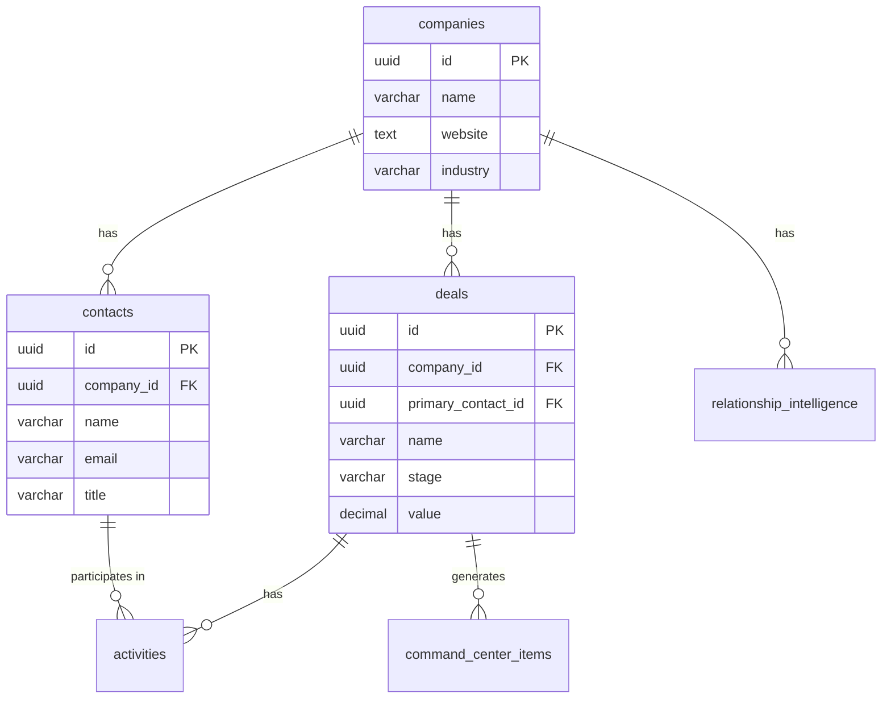
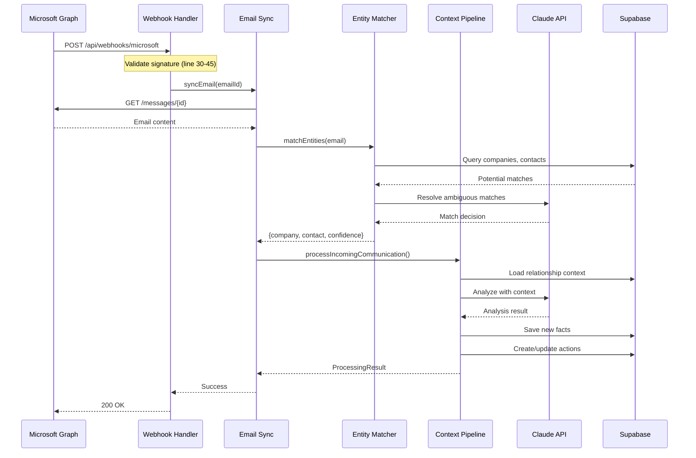

# Documentation Output Templates

> These templates define the exact structure for each generated document.
> Claude Code MUST follow these formats exactly.

---

## MANIFEST.md Template

```markdown
# X-FORCE Codebase Manifest

**Generated:** [TIMESTAMP]
**Verified By:** [USER NAME or "Pending Verification"]
**Git Commit:** [COMMIT HASH if available]

---

## Summary Statistics

| Category | Count |
|----------|-------|
| Source Directories | X |
| Source Files | Y |
| API Routes | Z |
| Database Tables | W |
| Migration Files | V |
| Script Files | U |
| Component Files | T |

---

## Directory Structure

### `/src/app/`
```
src/app/
├── (dashboard)/
│   ├── page.tsx
│   ├── layout.tsx
│   └── [subdirectories...]
├── api/
│   ├── command-center/
│   │   ├── route.ts
│   │   └── [itemId]/
│   │       ├── route.ts
│   │       ├── context/route.ts
│   │       └── add-context/route.ts
│   └── [other routes...]
└── ...
```

### `/src/lib/`
```
src/lib/
├── intelligence/
│   ├── index.ts
│   ├── contextFirstPipeline.ts [ACTIVE]
│   ├── entityMatcher.ts [ACTIVE]
│   ├── autoLinkEntities.ts [DEPRECATED]
│   └── ...
├── microsoft/
│   └── ...
├── supabase/
│   └── ...
└── ...
```

### `/src/components/`
```
src/components/
├── commandCenter/
│   ├── CommandCenter.tsx
│   ├── ActionCard.tsx
│   └── ...
├── deals/
│   └── ...
└── ...
```

### `/supabase/migrations/`
```
supabase/migrations/
├── 20241201000000_initial_schema.sql
├── 20241210000000_add_intelligence.sql
└── ...
```

### `/scripts/`
```
scripts/
├── integration-test-pipeline.ts
├── test-entity-matcher.ts
└── ...
```

---

## File Status Legend

- `[ACTIVE]` - Currently in use, maintained
- `[TRANSITIONAL]` - Being migrated, still in use
- `[DEPRECATED]` - Scheduled for removal
- `[DEAD]` - No longer called, safe to delete

---

## Verification Checklist

- [ ] All directories under src/ are listed
- [ ] All API routes are enumerated
- [ ] All migration files are listed
- [ ] All script files are listed
- [ ] Status labels are accurate
- [ ] User has confirmed completeness
```

---

## DATABASE.md Template

```markdown
# X-FORCE Database Schema

**Generated:** [TIMESTAMP]
**Database:** Supabase (PostgreSQL)
**Migration Count:** X files
**Table Count:** Y tables

---

## Table of Contents

1. [Core CRM Tables](#core-crm-tables)
2. [Intelligence Tables](#intelligence-tables)
3. [Activity Tables](#activity-tables)
4. [System Tables](#system-tables)
5. [Entity Relationship Diagram](#entity-relationship-diagram)
6. [Migration History](#migration-history)

---

## Core CRM Tables

### `companies`

**Purpose:** Stores prospect and customer organizations
**Created:** `migrations/20241201_initial.sql` (line 15)
**Modified:** `migrations/20241215_add_fields.sql` (line 8)

| Column | Type | Constraints | Default | Description |
|--------|------|-------------|---------|-------------|
| id | UUID | PK | gen_random_uuid() | Primary identifier |
| name | VARCHAR(255) | NOT NULL | | Company name |
| website | TEXT | | | Company website URL |
| industry | VARCHAR(100) | | | Industry classification |
| employee_count | INTEGER | | | Estimated employee count |
| created_at | TIMESTAMPTZ | NOT NULL | NOW() | Record creation time |
| updated_at | TIMESTAMPTZ | NOT NULL | NOW() | Last update time |
| deleted_at | TIMESTAMPTZ | | | Soft delete timestamp |

**Indexes:**
| Name | Columns | Type | Migration |
|------|---------|------|-----------|
| companies_pkey | id | PRIMARY KEY | 20241201_initial.sql:20 |
| idx_companies_name | name | BTREE | 20241201_initial.sql:25 |
| idx_companies_industry | industry | BTREE | 20241205_indexes.sql:10 |

**RLS Policies:**
| Policy | Operation | Using | With Check | Migration |
|--------|-----------|-------|------------|-----------|
| companies_select | SELECT | user_id = auth.uid() | | 20241201_initial.sql:30 |
| companies_insert | INSERT | | user_id = auth.uid() | 20241201_initial.sql:35 |

**Foreign Keys Referencing This Table:**
| Table | Column | On Delete |
|-------|--------|-----------|
| contacts | company_id | CASCADE |
| deals | company_id | SET NULL |

---

### `contacts`
[Same format...]

---

## Entity Relationship Diagram



---

## Migration History

| Order | File | Date | Description | Tables Affected |
|-------|------|------|-------------|-----------------|
| 1 | 20241201_initial.sql | Dec 1, 2024 | Initial schema | companies, contacts, deals, users |
| 2 | 20241205_indexes.sql | Dec 5, 2024 | Add performance indexes | companies, contacts |
| 3 | 20241210_intelligence.sql | Dec 10, 2024 | Add intelligence tables | relationship_intelligence, command_center_items |

---

## Verification Checklist

- [ ] All tables from migrations are documented
- [ ] All columns match migration definitions
- [ ] All indexes are listed
- [ ] All RLS policies are documented
- [ ] ERD accurately reflects relationships
- [ ] Migration history is complete and ordered
```

---

## API.md Template

```markdown
# X-FORCE API Reference

**Generated:** [TIMESTAMP]
**Base URL:** `/api`
**Auth:** Supabase Session (unless noted)
**Route Count:** X endpoints

---

## Table of Contents

1. [Command Center](#command-center)
2. [Intelligence](#intelligence)
3. [Email](#email)
4. [Webhooks](#webhooks)

---

## Command Center

### GET `/api/command-center`

**File:** `src/app/api/command-center/route.ts`
**Lines:** 10-45
**Auth Required:** Yes

**Description:** Fetches all command center items for the current user

**Query Parameters:**
| Param | Type | Required | Default | Description |
|-------|------|----------|---------|-------------|
| tier | number | No | | Filter by tier (1-5) |
| status | string | No | 'open' | Filter by status |
| limit | number | No | 50 | Max items to return |

**Response (200):**
```typescript
// Defined at src/types/commandCenter.ts:15
{
  items: Array<{
    id: string;
    tier: 1 | 2 | 3 | 4 | 5;
    title: string;
    description: string;
    company_id: string | null;
    contact_id: string | null;
    deal_id: string | null;
    workflow_steps: Array<{
      id: string;
      title: string;
      completed: boolean;
    }>;
    created_at: string;
    due_at: string | null;
  }>;
  total: number;
}
```

**Response (401):**
```json
{ "error": "Unauthorized" }
```

**Response (500):**
```json
{ "error": "Internal server error", "details": "..." }
```

**Example:**
```bash
curl -X GET 'https://app.example.com/api/command-center?tier=1&limit=10' \
  -H 'Authorization: Bearer TOKEN'
```

**Dependencies:**
- `src/lib/supabase/server.ts` → `createClient` (line 3)
- `src/lib/commandCenter/queries.ts` → `getItems` (line 5)

**Database Operations:**
- SELECT from `command_center_items` (line 25)
- JOIN with `companies`, `contacts`, `deals` (line 28)

---

### POST `/api/command-center/[itemId]/complete`
[Same format...]

---

## Verification Checklist

- [ ] All route.ts files are documented
- [ ] All HTTP methods per route are listed
- [ ] Request/response types match actual code
- [ ] Auth requirements are accurate
- [ ] Dependencies are traced
- [ ] Database operations are identified
```

---

## MODULES.md Template

```markdown
# X-FORCE Library Modules

**Generated:** [TIMESTAMP]
**Module Count:** X directories
**File Count:** Y files

---

## Module Status Summary

| Module | Active | Transitional | Deprecated | Total |
|--------|--------|--------------|------------|-------|
| intelligence | 8 | 4 | 5 | 17 |
| microsoft | 6 | 0 | 0 | 6 |
| supabase | 3 | 0 | 0 | 3 |
| fireflies | 4 | 0 | 1 | 5 |

---

## `src/lib/intelligence/`

**Purpose:** AI-powered analysis of communications, entity matching, and relationship intelligence
**File Count:** 17
**Primary Entry Point:** `contextFirstPipeline.ts`

### Status Overview

| File | Status | Lines | Last Modified |
|------|--------|-------|---------------|
| contextFirstPipeline.ts | 🟢 ACTIVE | 450 | Dec 21, 2024 |
| entityMatcher.ts | 🟢 ACTIVE | 320 | Dec 21, 2024 |
| salesPlaybook.ts | 🟢 ACTIVE | 280 | Dec 17, 2024 |
| autoLinkEntities.ts | 🔴 DEPRECATED | 200 | Dec 15, 2024 |

---

### `contextFirstPipeline.ts`

**Status:** 🟢 ACTIVE
**Purpose:** Main entry point for processing all incoming communications
**Lines:** 1-450

#### Exports

| Export | Type | Line | Description |
|--------|------|------|-------------|
| processIncomingCommunication | async function | 45 | Orchestrates the full pipeline |
| ProcessingResult | interface | 12 | Return type for main function |
| ProcessingOptions | interface | 20 | Configuration options |

#### Function Details

##### `processIncomingCommunication`

```typescript
// Lines 45-52
export async function processIncomingCommunication(
  communication: IncomingCommunication,
  options?: ProcessingOptions
): Promise<ProcessingResult>
```

**Parameters:**
| Name | Type | Required | Description |
|------|------|----------|-------------|
| communication | IncomingCommunication | Yes | The email, transcript, or note to process |
| options | ProcessingOptions | No | Override default behaviors |

**Return Value:**
```typescript
// Lines 12-18
interface ProcessingResult {
  success: boolean;
  company: { id: string; confidence: number } | null;
  contact: { id: string; confidence: number } | null;
  deal: { id: string } | null;
  actionsCreated: string[];
  factsExtracted: number;
  errors: string[];
}
```

**Internal Flow:**
1. Line 60-80: Call `matchEntities()` to identify company/contact
2. Line 85-100: Call `loadContext()` to get existing relationship data
3. Line 105-150: Call Claude API for analysis with context
4. Line 155-180: Call `saveContext()` to store new facts
5. Line 185-220: Call `reconcileActions()` to create/update items

**Error Handling:**
- Lines 225-240: Catches entity matching failures, returns partial result
- Lines 245-260: Catches AI API failures, logs and continues
- Lines 265-280: Catches database failures, rolls back

#### Dependencies

**Internal (src/lib):**
| Import | From | Line | Functions Used |
|--------|------|------|----------------|
| matchEntities | ./entityMatcher | 5 | matchEntities |
| loadContext, saveContext | ./relationshipStore | 6 | loadContext, saveContext |
| PLAYBOOK | ./salesPlaybook | 7 | PLAYBOOK constant |
| reconcileActions | ./reconcileActions | 8 | reconcileActions |

**External (npm):**
| Import | Package | Line | Purpose |
|--------|---------|------|---------|
| Anthropic | @anthropic-ai/sdk | 3 | Claude API client |

**Database Tables:**
| Table | Operation | Lines | Purpose |
|-------|-----------|-------|---------|
| companies | SELECT | 120-125 | Load company data for context |
| contacts | SELECT | 130-135 | Load contact data for context |
| deals | SELECT | 140-145 | Load deal data for context |
| relationship_intelligence | SELECT, INSERT | 155-180 | Load/save relationship facts |
| command_center_items | INSERT, UPDATE | 185-220 | Create/modify action items |

---

### `entityMatcher.ts`
[Same format...]

---

## Verification Checklist

- [ ] Every file in each lib/ directory is documented
- [ ] All exports are listed with correct types
- [ ] All function parameters and returns are documented
- [ ] All imports are traced
- [ ] All database operations are identified
- [ ] Status labels are accurate
```

---

## WORKFLOWS.md Template

```markdown
# X-FORCE Workflows

**Generated:** [TIMESTAMP]
**Workflow Count:** X documented flows

---

## Workflow Index

1. [Email Sync Flow](#email-sync-flow)
2. [Context-First Pipeline Flow](#context-first-pipeline-flow)
3. [Command Center Action Flow](#command-center-action-flow)
4. [Meeting Transcript Processing](#meeting-transcript-processing)
5. [Entity Matching Logic](#entity-matching-logic)

---

## Email Sync Flow

**Trigger:** Microsoft webhook notification
**End State:** Email processed, actions created in command center
**Duration:** ~2-5 seconds

### Sequence Diagram



### Step-by-Step

#### Step 1: Webhook Reception
**File:** `src/app/api/webhooks/microsoft/route.ts`
**Lines:** 25-50

```typescript
// Line 30-35: Signature validation
const isValid = validateMicrosoftSignature(
  request.headers.get('x-ms-signature'),
  await request.text()
);
```

**Input:** Microsoft webhook payload
**Output:** Validated email notification ID
**Error Handling:** Returns 401 if signature invalid (line 40)

---

#### Step 2: Email Fetch
**File:** `src/lib/microsoft/emailSync.ts`
**Function:** `fetchEmailById` (line 80)

```typescript
// Line 85-95
const response = await graphClient
  .api(`/me/messages/${emailId}`)
  .select('subject,body,from,toRecipients,receivedDateTime')
  .get();
```

**Input:** Email ID from webhook
**Output:** Full email object with body, headers
**Error Handling:** Retries 3x with exponential backoff (line 100-115)

---

#### Step 3: Entity Matching
**File:** `src/lib/intelligence/entityMatcher.ts`
**Function:** `matchEntities` (line 45)

**Input:** 
- Email from/to addresses
- Email subject
- Email body snippet (first 500 chars)

**Process:**
1. Extract all email domains (line 60)
2. Query companies by domain match (line 70)
3. Query contacts by email exact match (line 80)
4. If ambiguous, call Claude for resolution (line 100)

**Output:**
```typescript
{
  company: { id: string, confidence: number } | null,
  contact: { id: string, confidence: number } | null,
  deal: { id: string } | null,
  isNewContact: boolean,
  reasoning: string
}
```

---

[Continue for each step...]

---

## Verification Checklist

- [ ] All major workflows are documented
- [ ] Each step cites specific file and line numbers
- [ ] Mermaid diagrams are accurate
- [ ] Error handling paths are documented
- [ ] Input/output for each step is specified
```

---

## ENVIRONMENT.md Template

```markdown
# X-FORCE Environment Configuration

**Generated:** [TIMESTAMP]
**Variable Count:** X variables
**Required Count:** Y required

---

## Required Variables

| Variable | Used In | Purpose |
|----------|---------|---------|
| `NEXT_PUBLIC_SUPABASE_URL` | src/lib/supabase/client.ts:5 | Supabase project URL |
| `NEXT_PUBLIC_SUPABASE_ANON_KEY` | src/lib/supabase/client.ts:6 | Supabase anonymous key |
| `SUPABASE_SERVICE_ROLE_KEY` | src/lib/supabase/server.ts:8 | Supabase admin access |
| `ANTHROPIC_API_KEY` | src/lib/ai/client.ts:3 | Claude API access |
| `MICROSOFT_CLIENT_ID` | src/lib/microsoft/auth.ts:10 | MS Graph OAuth |
| `MICROSOFT_CLIENT_SECRET` | src/lib/microsoft/auth.ts:11 | MS Graph OAuth |
| `MICROSOFT_TENANT_ID` | src/lib/microsoft/auth.ts:12 | MS Graph OAuth |

---

## Optional Variables

| Variable | Default | Used In | Purpose |
|----------|---------|---------|---------|
| `ANTHROPIC_MODEL` | claude-3-sonnet | src/lib/ai/client.ts:8 | Which Claude model |
| `LOG_LEVEL` | info | src/lib/logger.ts:5 | Logging verbosity |
| `WEBHOOK_SECRET` | (none) | src/app/api/webhooks:15 | Webhook validation |

---

## Variable Details

### `ANTHROPIC_API_KEY`

**Required:** Yes
**Format:** `sk-ant-...`
**Used In:**
- `src/lib/ai/client.ts` (line 3)
- `src/lib/intelligence/entityMatcher.ts` (line 15, via client)
- `src/lib/intelligence/contextFirstPipeline.ts` (line 20, via client)

**How to Obtain:**
1. Go to console.anthropic.com
2. Create API key
3. Copy to .env.local

---

## Verification Checklist

- [ ] All process.env usages found via grep
- [ ] Required vs optional correctly classified
- [ ] All files using each variable are listed
- [ ] Defaults are documented where applicable
```

---

## SCRIPTS.md Template

```markdown
# X-FORCE Scripts Reference

**Generated:** [TIMESTAMP]
**Script Count:** X scripts

---

## Script Index

| Script | Purpose | Safe to Run | Modifies Data |
|--------|---------|-------------|---------------|
| integration-test-pipeline.ts | Test context-first pipeline | ✅ Yes | ⚠️ Creates test data |
| test-entity-matcher.ts | Unit test entity matching | ✅ Yes | ❌ No |
| dedupe-command-center.ts | Remove duplicate items | ⚠️ Review first | ✅ Yes |

---

## `scripts/integration-test-pipeline.ts`

**Purpose:** End-to-end test of the context-first processing pipeline
**Lines:** 1-250
**Last Modified:** Dec 21, 2024

### Usage

```bash
# Run with test data
npx tsx scripts/integration-test-pipeline.ts

# Run with specific company
npx tsx scripts/integration-test-pipeline.ts --company-id=abc123
```

### Required Environment
- `SUPABASE_URL`
- `SUPABASE_SERVICE_ROLE_KEY`
- `ANTHROPIC_API_KEY`

### What It Does

1. **Setup (lines 20-40):** Creates test email fixture
2. **Execute (lines 45-80):** Calls `processIncomingCommunication()`
3. **Validate (lines 85-150):** Checks 7 assertions:
   - Company matched with ≥70% confidence
   - Contact matched or identified as new
   - Context was loaded before analysis
   - Facts were extracted and saved
   - Actions were created
   - No duplicate actions
   - Deal stage updated if applicable
4. **Cleanup (lines 155-180):** Removes test data

### Output

```
✅ Company identified: Lawn Doctor (confidence: 100%)
✅ Contact identified: Andy Canniff (confidence: 100%)
✅ Context loaded: 20 facts, 7 interactions
✅ Context grew: 20→26 facts
✅ Actions created: 4 new, 1 obsoleted
✅ New stakeholder detected: Maria Santos
✅ Deal stage updated: → implementation

PASSED: 7/7 checks
```

### Modifies Database
- Creates rows in: `relationship_intelligence`, `command_center_items`
- Deletes test data on completion (or failure)

---

## Verification Checklist

- [ ] All scripts in /scripts/ documented
- [ ] Usage instructions are accurate
- [ ] Required env vars listed
- [ ] Data modification warnings included
```
